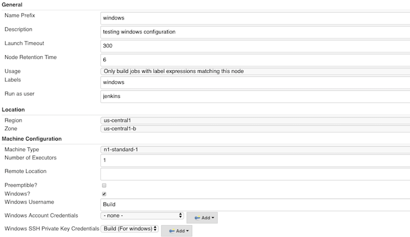
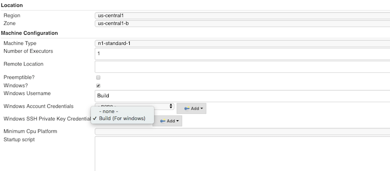
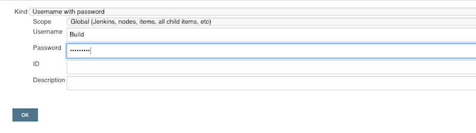
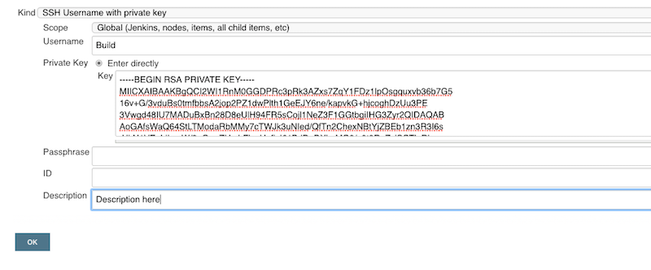

////
Copyright 2020 Google LLC
Copyright 2026 CloudBees, Inc.

 Licensed under the Apache License, Version 2.0 (the "License"); you may not use this file except in
 compliance with the License. You may obtain a copy of the License at

        https://www.apache.org/licenses/LICENSE-2.0

 Unless required by applicable law or agreed to in writing, software distributed under the License
 is distributed on an "AS IS" BASIS, WITHOUT WARRANTIES OR CONDITIONS OF ANY KIND, either express or
 implied. See the License for the specific language governing permissions and limitations under the
 License.
////
:doctype: book
:experimental:
:toc: macro
:toc-title:

image:https://ci.jenkins.io/job/Plugins/job/google-compute-engine-plugin/job/master/badge/icon[Build Status,link=https://ci.jenkins.io/job/Plugins/job/google-compute-engine-plugin/job/develop/]
image:https://img.shields.io/github/contributors/jenkinsci/google-compute-engine-plugin.svg[Contributors,link=https://github.com/jenkinsci/google-compute-engine-plugin/graphs/contributors]
image:https://img.shields.io/jenkins/plugin/v/google-compute-engine.svg[Jenkins Plugin,link=https://plugins.jenkins.io/google-compute-engine]
image:https://img.shields.io/github/v/tag/jenkinsci/google-compute-engine-plugin?label=changelog[GitHub release,link=https://github.com/jenkinsci/google-compute-engine-plugin/blob/develop/CHANGELOG.md]
image:https://img.shields.io/jenkins/plugin/i/google-compute-engine.svg?color=blue[Jenkins Plugin Installs,link=https://plugins.jenkins.io/google-compute-engine]

[[google-compute-engine-plugin-for-jenkins]]
= Google Compute Engine Plugin for Jenkins

The Google Compute Engine (GCE) Plugin provisions GCE virtual machines as Jenkins agents. Agents are launched when builds need them and terminated when idle or when the build completes (one-shot mode). Supports Linux and Windows VMs, Spot and Preemptible instances, startup scripts, GPUs, and secondary disks. Compatible with https://jenkins.io/projects/jcasc/[Jenkins Configuration as Code].

toc::[]

[[prerequisites]]
== Prerequisites

* A GCP project with the https://console.cloud.google.com/apis/api/compute.googleapis.com[Compute Engine API] enabled
* A GCP service account with the required IAM permissions. See <<create-a-gcp-service-account,Create a GCP Service Account>>.
* A GCE agent image with Java installed. Java 25 is recommended (Java 21 also works; Java 17 was dropped from Jenkins weekly in Jan 2026 and from the LTS line in April 2026). See <<preparing-agent-images,Preparing Agent Images>>.

[[gcp-authentication]]
== GCP Authentication

[[create-a-gcp-service-account]]
=== Create a GCP Service Account

[source,bash]
----
gcloud iam service-accounts create jenkins-gce

export PROJECT=$(gcloud info --format='value(config.project)')
export SA_EMAIL=$(gcloud iam service-accounts list \
  --filter="name:jenkins-gce" --format='value(email)')
----

[[iam-permissions]]
==== IAM Permissions

The plugin needs a narrow set of Compute Engine permissions. Create a custom role with only what is required:

[source,bash]
----
gcloud -q iam roles create jenkinsGcePlugin --project="$PROJECT" \
  --title="Jenkins GCE Plugin" \
  --description="Minimum permissions for the Jenkins GCE plugin" \
  --permissions="\
compute.instances.create,compute.instances.delete,compute.instances.get,compute.instances.list,\
compute.instances.setLabels,compute.instances.setMetadata,compute.instances.setTags,\
compute.instances.getGuestAttributes,\
compute.disks.create,compute.disks.use,compute.disks.createSnapshot,\
compute.snapshots.create,compute.snapshots.delete,compute.snapshots.get,\
compute.images.get,compute.images.list,compute.images.useReadOnly,\
compute.subnetworks.list,compute.subnetworks.use,compute.subnetworks.useExternalIp,\
compute.networks.list,compute.networks.use,compute.networks.useExternalIp,\
compute.instanceTemplates.get,compute.instanceTemplates.list,compute.instanceTemplates.useReadOnly,\
compute.machineTypes.list,compute.diskTypes.list,compute.regions.list,compute.zones.list,\
compute.zones.get,compute.zoneOperations.get,compute.acceleratorTypes.list"

gcloud projects add-iam-policy-binding $PROJECT \
  --member serviceAccount:$SA_EMAIL \
  --role "projects/$PROJECT/roles/jenkinsGcePlugin" \
  --condition None
----

If your builds need to call GCP APIs from inside the agent VM, see <<iam,Service Account E-mail>> for additional IAM setup.

[[add-credentials-to-jenkins]]
=== Add Credentials to Jenkins

Choose one of the following based on where your Jenkins controller runs.

[[option-a-json-service-account-key]]
==== Option A: JSON Service Account Key

Prefer identity federation (Options B or C) when possible — even on another cloud, https://cloud.google.com/iam/docs/workload-identity-federation[Workload Identity Federation] (GCP docs) avoids managing key files. Use a JSON key only when federation is not an option.

. Download a JSON key for the service account:
+
[source,bash]
----
gcloud iam service-accounts keys create \
  --iam-account $SA_EMAIL jenkins-gce.json
----

. In Jenkins, add a credential of type *Google Service Account from private key* and enter the details.

CasC credential type: `googleRobotPrivateKeyCredentials`.

[[option-b-gce-vm-metadata]]
==== Option B: GCE VM Metadata

Use this when Jenkins runs on a GCE VM. No JSON key is needed. The VM's own service account is used via the metadata server. Assign the required IAM roles (listed in <<prerequisites,Prerequisites>>) to the VM's service account.

In Jenkins, add a credential of type *Google Service Account from metadata* and enter the Project ID.

CasC credential type: `googleRobotMetadata`.

[[option-c-workload-identity-gke]]
==== Option C: Workload Identity (GKE)

Use this when Jenkins runs on GKE. No JSON key is needed. The Kubernetes service account impersonates the GCP service account via https://cloud.google.com/kubernetes-engine/docs/concepts/workload-identity[Workload Identity Federation].

. Bind the Kubernetes service account to the GCP service account:
+
[source,bash]
----
gcloud iam service-accounts add-iam-policy-binding $SA_EMAIL \
  --member "serviceAccount:$PROJECT.svc.id.goog[<namespace>/<k8s-service-account>]" \
  --role roles/iam.workloadIdentityUser
----
+
Replace `<namespace>/<k8s-service-account>` with the namespace and service account of the Jenkins controller pod (e.g. `jenkins/jenkins`).

. In Jenkins, add a credential of type *Google Service Account from metadata* and enter the Project ID.

CasC credential type: `googleRobotMetadata`.

[[preparing-agent-images]]
== Preparing Agent Images

The plugin connects to agents via SSH and requires Java on the agent (Java 25 recommended; Java 21 also works). Pre-baking Java and other static dependencies into a GCE image reduces agent startup time compared to installing them via startup scripts. The plugin's own integration test images use https://www.packer.io/[Packer], and you can follow the same approach. Additional tools (Maven, Docker, etc.) can also be added to the Packer provisioner. Startup scripts are better suited for dynamic per-boot configuration.

[[linux]]
=== Linux

*Image requirements:*

* Java 25 (or 21) installed. On PATH by default, or configure via *Java Path* (`javaExecPath`).
* SSH server running (included by default on most Linux images)

The plugin's link:./testimages/linux/[`testimages/linux/`] directory contains a working Packer setup that builds a Debian 12 image with Temurin 25 JRE:

[source,bash]
----
cd testimages/linux
bash setup-gce-image.sh
----

This creates an image named `jenkins-gce-integration-test-jre` in your GCP project. Use `--recreate` to rebuild or `--delete` to remove it. See link:./testimages/linux/install-java.sh[`install-java.sh`] for the provisioning steps.

[[windows]]
=== Windows

*Image requirements:*

* Java 25 installed (Java 21 also works). On PATH by default, or configure via *Java Path* (`javaExecPath`).
* OpenSSH Server installed and running
* Authentication via one of:
 ** *Password*: an administrative user with a known username and password
 ** *SSH key*: the public key placed in the image's `administrators_authorized_keys` file

The plugin's link:./testimages/windows/[`testimages/windows/`] directory contains a working Packer setup that builds a Windows Server 2022 image with Temurin 25 JRE (Java 21 also works), OpenSSH, and a `jenkins` admin user (password-based):

[source,bash]
----
export JENKINS_PASSWORD=your-secure-password  # default: Agent007!
cd testimages/windows
bash setup-gce-image.sh
----

This creates an image named `jenkins-gce-integration-test-windows-jre`. The Packer image build runs from any platform (macOS, Linux) and does not require a Windows machine. See link:./testimages/windows/install-java.ps1[`install-java.ps1`] for the provisioning steps.

[[configuration]]
== Configuration

[[add-a-gce-cloud]]
=== Add a GCE Cloud

Each GCE cloud configuration points to a single GCP project. You can add multiple clouds for different projects.

. Go to menu:Manage Jenkins[Clouds].
. Click menu:Add a new cloud[Google Compute Engine].
. Enter a *Name* for the cloud and the *Project ID*.
. Select the credentials you added in the previous step from the *Service Account Credentials* dropdown.
. Optionally, set the *Instance Cap* to limit the total number of concurrent VMs.

*Cloud fields and their CasC keys:*

|===
| Field | CasC Key | Description

| *Name*
| `cloudName`
| Display name for this cloud. _Required._

| *Project ID*
| `projectId`
| GCP project ID. _Required._

| *Instance Cap*
| `instanceCapStr`
| Optional. Max concurrent VMs across all instance configurations. If set and the cap is reached, no new agents are provisioned until existing ones terminate.

| *Service Account Credentials*
| `credentialsId`
| Jenkins credential ID for the GCP service account. _Required._

| *No delay provisioning*
| `noDelayProvisioning`
| Provision immediately without waiting for Jenkins' load estimation cycle. Default: `false`. See <<provisioning-behavior,Provisioning Behavior>>.
|===

[[instance-configuration]]
=== Instance Configuration

Instance configurations define what kind of VM to launch for a given set of Jenkins labels. Multiple instance configurations can be added per cloud.

[[general]]
==== General

|===
| Field | CasC Key | Description

| *Name Prefix*
| `namePrefix`
| Prefix for VM names. Must match `[a-z]([-a-z0-9]*[a-z0-9])?`, max 50 characters. A random suffix is appended.

| *Description*
| `description`
| Display name for this configuration in the Jenkins UI.

| *Node Retention Time*
| `retentionTimeMinutesStr`
| Minutes to keep an idle agent before termination. Default: 6.

| *Usage*
| `mode`
| `Use this node as much as possible` (NORMAL) or `Only build jobs with label expressions matching this node` (EXCLUSIVE). Default: NORMAL.

| *Labels*
| `labelString`
| Space-separated labels for matching builds to this configuration. When set to Exclusive mode, only builds requesting these labels will use this agent type.

| *Number of Executors*
| `numExecutorsStr`
| Parallel build slots per agent. Default: 1. Must be 1 when one-shot is enabled.

| *Terminate idle agents during shutdown*
| `terminateIdleDuringShutdown`
| Delete idle agents and their GCE instances when the Jenkins controller stops. Default: false.

| *Minimum Number of Instances*
| `minimumNumberOfInstances`
| Total agents (busy + idle) to maintain at all times. Default: 0 (disabled). See <<minimum-instance-scaling,Minimum Instance Scaling>>.

| *Minimum Number of Spare Instances*
| `minimumNumberOfSpareInstances`
| Idle agents to keep ready for incoming builds. Default: 0 (disabled). See <<minimum-instance-scaling,Minimum Instance Scaling>>.

| *Time Range*
| `minimumNumberOfInstancesTimeRangeConfig`
| Optionally restrict minimum instance scaling to specific hours and days of the week. Supports `HH:mm` or `h:mm a` time formats.
|===

[[launch-configuration]]
==== Launch Configuration

|===
| Field | CasC Key | Description

| *Launch Timeout*
| `launchTimeoutSecondsStr`
| Seconds to wait for an agent to connect before giving up. Default: 300.

| *Use Internal IP*
| `useInternalAddress`
| Connect to the agent via its internal IP even if an external IP is assigned. Use this when the Jenkins controller is in the same VPC. Default: false.

| *Ignore Jenkins Proxy*
| `ignoreProxy`
| Bypass the Jenkins HTTP proxy when connecting to the agent. Default: false.

| *Run as user*
| `runAsUser`
| SSH username on the agent. Default: `jenkins`.

| *Custom SSH Private Key*
| `sshConfiguration`
| Authenticate with a custom SSH key pair instead of the auto-generated one. The corresponding public key must be in the agent image's `~/.ssh/authorized_keys` for the configured user. Public key format: `ssh-rsa <key> <credential-id>`.

| *Remote Location*
| `remoteFs`
| Agent working directory. Default: `/tmp` (Linux) or `C:\` (Windows). On Windows, ensure the configured user has read/write permissions on this path -- `C:\` often causes permission issues; prefer a user-owned directory like `C:\Users\jenkins`.

| *Java Path*
| `javaExecPath`
| Path to the Java executable on the agent (e.g. `/usr/lib/jvm/java-21/bin/java`). Default: `java` (must be on PATH).

| *Windows*
| `windowsConfiguration`
| Enable for Windows VMs. See <<windows-configuration,Windows Configuration>>.
|===

[[one-shot]]
==== One-Shot

|===
| Field | CasC Key | Description

| *Enabled*
| `oneShot`
| Delete the agent after a single build completes, guaranteeing a clean environment. Number of executors must be 1. Default: false.

| *Create snapshot*
| `createSnapshot`
| Take a disk snapshot when a one-shot instance terminates. Useful for debugging failed builds by inspecting disk state. Only available when one-shot is enabled. Default: false.
|===

[[location]]
==== Location

|===
| Field | CasC Key | Description

| *Region*
| `region`
| GCP region (e.g. `us-central1`). Populates from your project.

| *Zone*
| `zone`
| GCP zone within the region (e.g. `us-central1-a`).

| *Fallback Zones*
| `fallbackZones`
| Optional. Comma- or space-separated zones to try, in order, when the primary zone returns a capacity error. Zones are normally in the primary zone's region (see <<fallback-zones>>).
|===

[[machine-configuration-advanced]]
==== Machine Configuration (Advanced)

These fields are inside the *Advanced* section of Machine Configuration.

|===
| Field | CasC Key | Description

| *Template*
| `template`
| Use a GCE https://cloud.google.com/compute/docs/instance-templates/[instance template] (GCP docs) instead of configuring machine details here. When a template is selected, all other advanced settings are ignored. The plugin only manages agent lifecycle and SSH keys.

| *Provisioning Type*
| `provisioningType`
| `Standard`, `Spot`, or `Preemptible`. Default: Standard. See <<provisioning-types-standard-spot-and-preemptible,Provisioning Types>>.

| *Max Run Duration Seconds*
| `maxRunDurationSeconds`
| (Standard and Spot only) GCP automatically deletes the VM after this many seconds. Nested under `provisioningType` in CasC. See https://cloud.google.com/compute/docs/instances/limit-vm-runtime[Limit VM runtime] (GCP docs).

| *Machine Type*
| `machineType`
| GCE machine type defining vCPUs and memory (e.g. `n1-standard-1`). Populates from your project and zone.

| *Minimum CPU Platform*
| `minCpuPlatform`
| Request a specific CPU generation (e.g. Intel Skylake).

| *Startup script*
| `startupScript`
| Bash (Linux) or PowerShell (Windows) script that runs before the agent connects.

| *Linux startup script exit reporter*
| `startupScriptExitReporterLinux`
| Script that reports startup completion to a GCE guest attribute so the controller waits before launching the agent. Uses `$1` as the exit code placeholder. Default: `curl`. Clear to disable waiting. See <<startup-script-exit-reporter,Startup Script Exit Reporter>>.

| *Windows startup script exit reporter*
| `startupScriptExitReporterWindows`
| Same as above for Windows. Uses `$args[0]` as the exit code placeholder. Default: `Invoke-RestMethod`.

| *Custom metadata*
| `customMetadata`
| Additional key-value pairs set as instance metadata. Accessible from within the VM via the https://cloud.google.com/compute/docs/metadata/overview[metadata server] (GCP docs). Values can be multiline (use YAML block scalars in CasC). Reserved keys (`ssh-keys`, `startup-script`, `windows-startup-script-ps1`, `enable-guest-attributes`) cannot be overridden.

| *Custom labels*
| `customLabels`
| Additional https://cloud.google.com/compute/docs/labeling-resources[GCP resource labels] (GCP docs) set on the agent VM. Each entry is a key-value pair. Label values must be a single word (lowercase letters, digits, hyphens; max 63 chars) — GCP rejects invalid values at instance-creation time. Labels are applied after internal plugin labels, so user-defined labels cannot clobber the plugin's system labels.

| *GPUs*
| `acceleratorConfiguration`
| Attach GPUs by specifying a type (e.g. `nvidia-tesla-t4`) and count. See https://cloud.google.com/compute/docs/gpus[GPUs on Compute Engine] (GCP docs).

| *Shielded VM*
| `shieldedVmConfiguration`
| Enable https://cloud.google.com/compute/shielded-vm/docs/shielded-vm[Shielded VM] (GCP docs) options (Secure Boot, vTPM, Integrity Monitoring). Optional; when omitted, `shieldedInstanceConfig` is not sent in the create request. See <<shielded-vm,Shielded VM>>.
|===

[[networking]]
==== Networking

|===
| Field | CasC Key | Description

| *Network Configuration*
| `networkConfiguration`
| `Autofilled` selects from networks/subnetworks in the current project. `Shared VPC` lets you specify a host project, region, and subnetwork name for cross-project networking.

| *Network tags*
| `networkTags`
| Space-delimited tags applied to the VM. Each tag must match `[a-z]([-a-z0-9]*[a-z0-9])?`. Use these to apply https://cloud.google.com/vpc/docs/firewalls[firewall rules] (GCP docs). At minimum, allow TCP port 22 from the Jenkins controller to agents.

| *IP stack type*
| `networkInterfaceIpStackMode`
| `Single stack` (IPv4 only) or `Dual stack` (IPv4 + IPv6). Default: Single stack.

| *External IPv4 Address*
| `externalIPV4Address`
| Attach an external IPv4 address. Nested under `singleStack` or `dualStack` in CasC. Without an external IP or a https://cloud.google.com/nat/docs/overview[Cloud NAT] (GCP docs) gateway, the VM cannot reach the internet. Default: false.
|===

[[boot-disk]]
==== Boot Disk

|===
| Field | CasC Key | Description

| *Image project*
| `bootDiskSourceImageProject`
| GCP project containing the boot image. Your project is listed first, followed by well-known public projects (debian-cloud, ubuntu-os-cloud, windows-cloud, etc.).

| *Image name*
| `bootDiskSourceImageName`
| The OS image. Must have Java installed and accessible at the configured Java Path (see <<preparing-agent-images,Preparing Agent Images>>).

| *Disk Type*
| `bootDiskType`
| Storage type (e.g. `pd-ssd`, `pd-standard`, `pd-balanced`).

| *Size*
| `bootDiskSizeGbStr`
| Boot disk size in GB. Must be at least as large as the image requires. Default: 10.

| *Delete on termination*
| `bootDiskAutoDelete`
| Delete the boot disk when the instance is terminated. Default: true.
|===

[[disk-mapping]]
==== Disk Mapping

CasC key: `diskMapping` (String).

Attach additional disks to the instance. One disk per line, using comma-separated `key=value` pairs. The syntax follows the https://cloud.google.com/sdk/gcloud/reference/compute/instances/create[`gcloud compute instances create`] (GCP docs) CLI semantics. Additional disks are attached but not mounted. Use the startup script to format and mount them. Three modes:

. *Create from snapshot* (https://cloud.google.com/sdk/gcloud/reference/compute/instances/create#--create-disk[`--create-disk`] (GCP docs)): line contains `source-snapshot`:
+
----
source-snapshot=my-data-snapshot,size=100,type=pd-ssd,auto-delete=yes
----

. *Create blank disk* (https://cloud.google.com/sdk/gcloud/reference/compute/instances/create#--create-disk[`--create-disk`] (GCP docs)): line contains `size` or `type` but no `source-snapshot`:
+
----
size=200,type=pd-ssd,name=scratch-disk,auto-delete=yes
----

. *Attach existing disk* (https://cloud.google.com/sdk/gcloud/reference/compute/instances/create#--disk[`--disk`] (GCP docs)): line contains only `name`:
+
----
name=shared-data-disk,mode=ro,auto-delete=no
----

*Common keys* (all modes): `device-name`, `mode` (`ro` or `rw`, default `rw`), `interface` (`SCSI` or `NVME`), `auto-delete` (`yes` or `no`, default `yes`).

Short names for `source-snapshot`, `type`, and `name` are automatically qualified to the instance's project and zone. For cross-project resources, use a relative path (e.g. `+projects/{project}/global/snapshots/{name}+`).

[[iam]]
==== IAM

|===
| Field | CasC Key | Description

| *Service Account E-mail*
| `serviceAccountEmail`
| GCP service account attached to the agent VM. Optional. See below.
|===

Most users can leave this field empty. The https://cloud.google.com/compute/docs/access/service-accounts#default_service_account[default Compute Engine service account] (GCP docs) is attached automatically and is sufficient when your builds do not need to call GCP APIs from inside the VM.

Set this only when your builds need to call GCP APIs using the VM's service account (e.g., push to Artifact Registry, read from Cloud Storage). In that case:

. Create a dedicated agent service account with only the permissions your builds require.
. Add `compute.instances.setServiceAccount` to the controller SA's custom role.
. Grant `roles/iam.serviceAccountUser` on the agent SA to the controller SA (this grants `iam.serviceAccounts.actAs`, which GCP requires when attaching a service account to a VM):
+
[source,bash]
----
gcloud iam service-accounts add-iam-policy-binding AGENT_SA_EMAIL \
  --member "serviceAccount:CONTROLLER_SA_EMAIL" \
  --role roles/iam.serviceAccountUser
----

IMPORTANT: Do not use the Jenkins controller's service account as the agent service account. A compromised agent VM would inherit the controller's permissions (VM provisioning, deletion, etc.). Always use a separate, least-privilege service account scoped to your build workload.

[[windows-configuration]]
=== Windows Configuration

Linux agents require no platform-specific configuration. Windows VMs need additional setup.

The plugin connects to Windows agents over SSH, the same as Linux. Two authentication methods are supported:

* *Password*: provide a Username/Password credential in Jenkins. The Windows image must have an admin user with matching credentials.
* *SSH Private Key*: provide an SSH private key credential in Jenkins. The Windows image must have the corresponding public key in `$env:PROGRAMDATA\ssh\administrators_authorized_keys`.

*Steps:*

. Enable the *Windows* checkbox in the Launch Configuration section.
. Provide either a *Password Credential* or a *Private Key Credential* for authentication. At least one is required.
. Set *Run as user* to match the Windows admin username.

For password-based authentication, create a Username/Password credential in Jenkins:

For SSH key-based authentication:

*Example startup script* (dynamic per-boot configuration, not static prerequisites):

[source,powershell]
----
# Pull build tools configuration from a GCS bucket
gsutil cp gs://my-build-config/settings.xml C:\Users\jenkins\.m2\settings.xml

# Register the agent with an internal package registry
$token = Invoke-RestMethod -Headers @{'Metadata-Flavor'='Google'} `
  -Uri "http://metadata.google.internal/computeMetadata/v1/instance/attributes/registry-token"
nuget sources Add -Name internal -Source https://registry.internal/nuget -UserName deploy -Password $token
----

Java, OpenSSH, and user accounts should be pre-baked into the image (see <<preparing-agent-images,Preparing Agent Images>>), not installed via startup scripts.

See the https://cloud.google.com/compute/docs/instances/windows[Windows VM Instances] on GCP docs for more details.

[[configuration-as-code-casc]]
=== Configuration as Code (CasC)

This plugin supports https://jenkins.io/projects/jcasc/[Jenkins Configuration as Code]. For machine-verified configurations used in the plugin's integration tests, see the YAML files in link:./src/test/resources/com/google/jenkins/plugins/computeengine/integration/[`+src/test/resources/.../integration/+`].

____
*Important -- short names vs full API URLs:*
Fields like `machineType`, `bootDiskType`, `bootDiskSourceImageName`, `region`, `zone`, `network`, and `subnetwork` accept both short names (e.g. `n1-standard-2`, `us-central1`) and full GCP API URLs (e.g. `+https://www.googleapis.com/compute/v1/projects/my-project/zones/us-central1-a/machineTypes/n1-standard-2+`). The examples below use short names for readability. The plugin's own link:./src/test/resources/com/google/jenkins/plugins/computeengine/integration/[integration test YAMLs] use full API URLs. If you encounter issues with short names in your environment, switch to full URLs.
____

[[basic-linux-agent]]
==== Basic Linux Agent

[source,yaml]
----
jenkins:
  clouds:
    - computeEngine:
        cloudName: gce-prod
        projectId: my-gcp-project
        instanceCapStr: "10"
        credentialsId: my-gcp-project
        configurations:
          - namePrefix: jenkins-agent
            description: Linux build agent
            mode: EXCLUSIVE
            labelString: linux gce
            numExecutorsStr: "1"
            runAsUser: jenkins
            javaExecPath: java
            retentionTimeMinutesStr: "6"
            launchTimeoutSecondsStr: "300"
            # Location
            region: us-central1
            zone: us-central1-a
            # Machine
            machineType: n1-standard-2
            # Networking — uses project default network
            networkConfiguration:
              autofilled:
                network: default
                subnetwork: default
            networkTags: jenkins-agent ssh
            networkInterfaceIpStackMode:
              singleStack:
                externalIPV4Address: true
            # Boot disk
            bootDiskSourceImageProject: my-gcp-project
            bootDiskSourceImageName: jenkins-gce-integration-test-jre  # built by testimages/linux/setup-gce-image.sh
            bootDiskType: pd-ssd
            bootDiskSizeGbStr: "50"
            bootDiskAutoDelete: true

credentials:
  system:
    domainCredentials:
      - credentials:
          # Option A: JSON key (Jenkins outside GCP)
          - googleRobotPrivateKeyCredentials:
              id: my-gcp-project
              projectId: my-gcp-project
              serviceAccountConfig:
                jsonServiceAccountConfig:
                  secretJsonKey: "{base64-encoded-json-key}"
          # Options B and C: GCE VM metadata or GKE Workload Identity
          # - googleRobotMetadata:
          #     id: my-gcp-project
          #     projectId: my-gcp-project
----

[[windows-agent]]
==== Windows Agent

[source,yaml]
----
jenkins:
  clouds:
    - computeEngine:
        cloudName: gce-windows
        projectId: my-gcp-project
        instanceCapStr: "5"
        credentialsId: my-gcp-project
        configurations:
          - namePrefix: win-agent
            description: Windows build agent
            mode: EXCLUSIVE
            labelString: windows gce
            numExecutorsStr: "1"
            runAsUser: jenkins
            oneShot: true
            # Windows: set passwordCredentialsId OR privateKeyCredentialsId (not both)
            windowsConfiguration:
              passwordCredentialsId: windows-password
              privateKeyCredentialsId: ""
            # Dynamic per-boot configuration (tools should be pre-baked in the image)
            startupScript: |
              # Pull environment-specific build config from GCS
              gsutil cp gs://my-build-config/nuget.config C:\Users\jenkins\nuget.config
            region: us-central1
            zone: us-central1-a
            machineType: n1-standard-2
            networkConfiguration:
              autofilled:
                network: default
                subnetwork: default
            networkTags: jenkins-agent ssh
            networkInterfaceIpStackMode:
              singleStack:
                externalIPV4Address: true
            bootDiskSourceImageProject: my-gcp-project
            bootDiskSourceImageName: jenkins-gce-integration-test-windows-jre  # built by testimages/windows/setup-gce-image.sh
            bootDiskType: pd-ssd
            bootDiskSizeGbStr: "50"
            bootDiskAutoDelete: true

credentials:
  system:
    domainCredentials:
      - credentials:
          - usernamePassword:
              scope: SYSTEM
              id: windows-password
              username: jenkins
              password: "Agent007!"  # default from testimages/windows/setup-gce-image.sh
----

[[advanced-usage]]
== Advanced Usage

The features in this section are optional. The plugin works with the basic configuration above.

[[provisioning-types-standard-spot-and-preemptible]]
=== Provisioning Types: Standard, Spot, and Preemptible

|===
| Type | Pricing | Termination | Max Run Duration

| *Standard*
| Full price, guaranteed by GCP SLAs
| Only when you delete it (or max run duration expires)
| Supported

| *Spot*
| Same as Preemptible (up to 60-91% discount)
| May be terminated if GCP needs resources; not subject to the 24-hour limit
| Supported

| *Preemptible*
| Same as Spot
| May be terminated if GCP needs resources; always terminated after 24 hours
| Not supported
|===

The *Max Run Duration Seconds* field (Standard and Spot only) sets a time limit after which GCP deletes the VM.

* https://cloud.google.com/compute/docs/instances/spot[Spot VMs] (GCP docs)
* https://cloud.google.com/compute/docs/instances/preemptible[Preemptible VMs] (GCP docs)

CasC syntax:

[source,yaml]
----
# Standard (default)
provisioningType:
  standard:
    maxRunDurationSeconds: 0    # 0 = no limit

# Spot with 3-hour limit
provisioningType:
  spotVm:
    maxRunDurationSeconds: 10800

# Preemptible
provisioningType:
  preemptibleVm: {}
----

NOTE: The legacy CasC field `preemptible: true` still works but is deprecated. Use `provisioningType: preemptibleVm` instead.

[[provisioning-behavior]]
=== Provisioning Behavior

[[no-delay-provisioning]]
==== No Delay Provisioning

Jenkins by default estimates load before provisioning cloud nodes. This plugin instead launches a new VM as soon as demand is detected, without waiting for the estimation cycle. This may result in extra VMs that are quickly terminated.

*To disable* this strategy:

* *System property*: set `com.google.jenkins.plugins.computeengine.disableNoDelayProvisioning=true`
* *UI*: uncheck the *No delay provisioning* checkbox in the cloud configuration.
* *CasC*: set `noDelayProvisioning: false` under the `computeEngine` cloud.

[[instance-cap]]
==== Instance Cap

The *Instance Cap* on the cloud limits total concurrent VMs across all instance configurations. If the cap is reached, no new agents are provisioned until existing ones terminate.

[[retention-and-termination]]
==== Retention and Termination

Idle agents are terminated after the configured *Node Retention Time* (default: 6 minutes). The *Launch Timeout* (default: 300 seconds) controls how long the plugin waits for a new agent to connect before giving up.

If *Terminate idle agents during shutdown* is enabled, idle agents are deleted when the Jenkins controller stops.

[[minimum-instance-scaling]]
=== Minimum Instance Scaling

Keep a pool of agents running so builds do not wait for provisioning.

*`minimumNumberOfInstances`*: the total number of agents (busy + idle) to maintain. When the retention strategy would terminate an idle agent, termination is blocked if it would drop below this minimum.

*`minimumNumberOfSpareInstances`*: the number of idle agents to keep ready. When all spare agents become busy, new ones are launched.

These two settings combine: set a total minimum of 3 and a spare minimum of 1, and you get 3 agents at rest with 1 always idle. As builds consume agents, new ones are launched to maintain the spare count, but the total can grow beyond 3 as demand requires.

*Time-range scheduling* restricts when minimums are enforced. Outside the window, idle agents are terminated normally. Use this for business-hours-only pools.

[source,yaml]
----
# Keep 3 agents running during business hours, with 1 always idle
configurations:
  - namePrefix: jenkins-agent
    description: Scaled build agent
    minimumNumberOfInstances: 3
    minimumNumberOfSpareInstances: 1
    minimumNumberOfInstancesTimeRangeConfig:
      activeFrom: "09:00"
      activeTo: "17:00"
      monday: true
      tuesday: true
      wednesday: true
      thursday: true
      friday: true
      saturday: false
      sunday: false
    # ... remaining fields same as basic example
----

How this works at runtime:

* build#1 starts: agent-1 busy, agent-2 idle, agent-3 idle
* build#2 starts: agent-1 busy, agent-2 busy, agent-3 idle
* build#3 starts: agent-1 busy, agent-2 busy, agent-3 busy, agent-4 launched (to maintain 1 spare)

Outside the configured time range, the minimum is not enforced and idle agents are terminated normally.

[[startup-script-exit-reporter]]
=== Startup Script Exit Reporter

When a startup script is configured, the plugin can wait for it to complete before connecting the agent. The plugin wraps the startup script with a trap (Linux) or try/finally (Windows) block. The exit reporter sends the script's exit code to a GCE guest attribute, and the controller polls this attribute before connecting to the agent and scheduling the build.

UI users can see the reporter scripts and alternatives via the field help icons. The sections below cover CasC configuration.

[[casc-configuration]]
==== CasC Configuration

Each instance configuration is either Linux or Windows, not both. The plugin uses `windowsConfiguration` to determine which exit reporter applies: if `windowsConfiguration` is set, the Windows reporter is used; otherwise the Linux reporter is used.

*Linux instance configuration:*

[source,yaml]
----
configurations:
  - namePrefix: linux-agent
    startupScript: |
      #!/bin/bash
      # Dynamic per-boot setup (tools should be pre-baked in the image)
      gsutil cp gs://my-build-config/settings.xml /home/jenkins/.m2/settings.xml
      chown jenkins:jenkins /home/jenkins/.m2/settings.xml
    # Uses $1 as the exit code placeholder. Default: curl.
    startupScriptExitReporterLinux: |
      curl -s -X PUT -H "Metadata-Flavor: Google" \
        "http://metadata.google.internal/computeMetadata/v1/instance/guest-attributes/startup-script/status" \
        -d "$1"
----

*Windows instance configuration:*

[source,yaml]
----
configurations:
  - namePrefix: win-agent
    windowsConfiguration:
      passwordCredentialsId: windows-password
    startupScript: |
      # Dynamic per-boot setup (tools should be pre-baked in the image)
      gsutil cp gs://my-build-config/nuget.config C:\Users\jenkins\nuget.config
    # Uses $args[0] as the exit code placeholder. Default: Invoke-RestMethod.
    startupScriptExitReporterWindows: |
      Invoke-RestMethod -Method PUT -Body "$($args[0])" `
        -Headers @{'Metadata-Flavor'='Google'} `
        -Uri "http://metadata.google.internal/computeMetadata/v1/instance/guest-attributes/startup-script/status"
----

[[disabling-waiting]]
==== Disabling Waiting

To have the agent connect as soon as SSH is available without waiting for the startup script to finish, simply omit the exit reporter field from your CasC. The plugin only wraps the startup script when the reporter field is non-empty.

[[alternative-linux-reporters]]
==== Alternative Linux Reporters

The default Linux reporter uses `curl`, which is widely available. If your image does not have `curl` (e.g. minimal container-optimized images), any tool capable of an HTTP PUT to `+http://metadata.google.internal/computeMetadata/v1/instance/guest-attributes/startup-script/status+` with the `Metadata-Flavor: Google` header will work. Keep `$1` as the exit code placeholder. Some examples:

*bash `/dev/tcp`* (no external tools):

[source,bash]
----
exec 3<>/dev/tcp/metadata.google.internal/80
printf "PUT /computeMetadata/v1/instance/guest-attributes/startup-script/status HTTP/1.0\r\nHost: metadata.google.internal\r\nMetadata-Flavor: Google\r\nContent-Length: ${#1}\r\n\r\n$1" >&3
exec 3>&-
----

*wget*:

[source,bash]
----
wget -q --method=PUT --header="Metadata-Flavor: Google" --body-data="$1" \
  "http://metadata.google.internal/computeMetadata/v1/instance/guest-attributes/startup-script/status" -O /dev/null
----

*python3*:

[source,bash]
----
python3 -c "import urllib.request; urllib.request.urlopen(urllib.request.Request( \
  'http://metadata.google.internal/computeMetadata/v1/instance/guest-attributes/startup-script/status', \
  data=b'$1', headers={'Metadata-Flavor':'Google'}, method='PUT'))"
----

The Windows default (`Invoke-RestMethod`) is built into PowerShell and does not typically need an alternative.

[[custom-metadata]]
=== Custom Metadata

Set https://cloud.google.com/compute/docs/metadata/overview[instance metadata] (GCP docs) key-value pairs on the agent VM. Accessible from within the VM at `+http://metadata.google.internal/computeMetadata/v1/instance/attributes/<key>+`. Values can be multiline (use YAML block scalars in CasC).

Reserved keys that cannot be used: `ssh-keys`, `startup-script`, `windows-startup-script-ps1`, `enable-guest-attributes`.

Simple key-value pairs:

[source,yaml]
----
configurations:
  - namePrefix: jenkins-agent
    customMetadata:
      - key: environment
        value: production
      - key: cluster
        value: build-pool
      - key: tier
        value: standard
    # ... remaining fields same as basic example
----

Multiline value (e.g. a config file or script fragment):

[source,yaml]
----
configurations:
  - namePrefix: jenkins-agent
    customMetadata:
      - key: allowed-registries
        value: |
          https://registry.internal.example.com
          https://docker.io
          https://gcr.io/my-project
    # ... remaining fields same as basic example
----

[[custom-labels]]
=== Custom Labels

Set https://cloud.google.com/compute/docs/labeling-resources[GCP resource labels] (GCP docs) on the agent VM. Labels are useful for cost allocation, filtering, and policy enforcement in GCP. Each entry is a key-value pair; label values must be a single word (no spaces). GCP rejects invalid labels at instance-creation time — the plugin does not validate values itself.

Labels are applied after the plugin's internal labels (`jenkins_node_last_refresh`), so user-defined labels cannot clobber them.

[source,yaml]
----
configurations:
  - namePrefix: jenkins-agent
    customLabels:
      - key: team
        value: platform
      - key: cost-center
        value: ci-1234
    # ... remaining fields same as basic example
----

[[shielded-vm]]
=== Shielded VM

Enable https://cloud.google.com/compute/shielded-vm/docs/shielded-vm[Shielded VM] (GCP docs) on the agent. Omit `shieldedVmConfiguration` to leave `shieldedInstanceConfig` out of the create request.

[source,yaml]
----
configurations:
  - namePrefix: jenkins-agent
    shieldedVmConfiguration:
      enableSecureBoot: true
      enableVtpm: true
      enableIntegrityMonitoring: true
    # ... remaining fields same as basic example
----

[[secondary-disks]]
=== Secondary Disks

Attach additional disks beyond the boot disk using the `diskMapping` field. The syntax follows the https://cloud.google.com/sdk/gcloud/reference/compute/instances/create[`gcloud compute instances create`] (GCP docs) CLI semantics. Disks are attached but not mounted. Use `device-name` to set the device path, then mount in the startup script via `/dev/disk/by-id/google-<device-name>`. See the <<disk-mapping,Disk Mapping>> field reference for the full syntax.

[[restore-from-snapshot]]
==== Restore from snapshot

Attach a disk created from an existing snapshot. The filesystem from the snapshot is preserved, so no formatting is needed.

[source,yaml]
----
configurations:
  - namePrefix: jenkins-agent
    diskMapping: |
      source-snapshot=projects/my-project/global/snapshots/build-cache-snap,device-name=cache,auto-delete=yes
    startupScript: |
      #!/bin/bash
      set -euo pipefail
      mkdir -p /mnt/cache
      mount /dev/disk/by-id/google-cache /mnt/cache
    # ... remaining fields same as basic example
----

[[create-a-blank-disk]]
==== Create a blank disk

Create a new empty disk. Requires formatting before use.

[source,yaml]
----
configurations:
  - namePrefix: jenkins-agent
    diskMapping: |
      size=200,type=pd-ssd,device-name=workspace,auto-delete=yes
    startupScript: |
      #!/bin/bash
      set -euo pipefail
      mkfs.ext4 -F /dev/disk/by-id/google-workspace
      mkdir -p /mnt/workspace
      mount /dev/disk/by-id/google-workspace /mnt/workspace
    # ... remaining fields same as basic example
----

[[attach-an-existing-disk]]
==== Attach an existing disk

Attach a pre-existing persistent disk. The filesystem is preserved. Use `auto-delete=no` to keep the disk after the instance is deleted.

[source,yaml]
----
configurations:
  - namePrefix: jenkins-agent
    diskMapping: |
      name=projects/my-project/zones/us-central1-a/disks/shared-data,device-name=data,mode=ro,auto-delete=no
    startupScript: |
      #!/bin/bash
      set -euo pipefail
      mkdir -p /mnt/data
      mount -o ro /dev/disk/by-id/google-data /mnt/data
    # ... remaining fields same as basic example
----

[[networking-casc-examples]]
=== Networking CasC Examples

[[private-networking-no-external-ip]]
==== Private Networking (No External IP)

[source,yaml]
----
# Private networking — requires Cloud NAT or VPN for internet access
configurations:
  - namePrefix: private-agent
    description: Private build agent
    networkInterfaceIpStackMode:
      singleStack:
        externalIPV4Address: false
    useInternalAddress: true    # controller connects via internal IP
    # ... remaining fields same as basic example
----

[[shared-vpc]]
==== Shared VPC

[source,yaml]
----
configurations:
  - namePrefix: jenkins-agent
    description: Agent in shared VPC
    networkConfiguration:
      sharedVpc:
        projectId: shared-vpc-host-project
        region: us-central1
        subnetworkShortName: jenkins-subnet
    # ... remaining fields same as basic example
----

[[capacity-fallback]]
== Capacity Fallback

When a GCE zone has no available capacity (`ZONE_RESOURCE_POOL_EXHAUSTED`), the plugin can provision elsewhere instead of failing the build. This works at three levels, which combine automatically.

Common to all levels: a capacity error puts that zone into a short cooldown (2 minutes by default, configurable via the `com.google.jenkins.plugins.computeengine.InstanceConfiguration.zoneExhaustionCooldownDuration` system property) during which it is skipped. Other errors (for example, quota, IAM, or an invalid configuration) do not trigger fallback. Jenkins re-attempts provisioning on its next cycle, so fallback progresses one step per cycle rather than all at once.

[[fallback-zones]]
=== Fallback zones within one configuration

Set *Fallback Zones* (`fallbackZones`) to a comma- or space-separated list of zones to try when this configuration's primary zone is exhausted.

[source,yaml]
----
configurations:
  - namePrefix: jenkins-agent
    region: us-central1
    zone: us-central1-a
    fallbackZones: us-central1-b, us-central1-c
    # ... remaining fields same as basic example
----

The primary zone is always tried first, then each fallback zone in the order listed. Zones are recommended to be in the same region as the primary zone, since a configuration's subnetwork is region-scoped. A zone in a different region may or may not provision depending on the subnetwork configuration; to reliably provision in a different region, use a separate instance configuration (below).

Example CasC: link:src/test/resources/com/google/jenkins/plugins/computeengine/integration/fallback-zone-casc.yml[fallback-zone-casc.yml].

[[fallback-configurations]]
=== Fallback across instance configurations

A configuration whose zones are all in cooldown steps aside for that cycle, letting another instance configuration that matches the same label provision instead. This applies even if neither configuration sets `fallbackZones` — defining a second configuration with the same label is enough to get fallback across, for example, different machine types or region.

Example CasC: link:src/test/resources/com/google/jenkins/plugins/computeengine/integration/fallback-config-casc.yml[fallback-config-casc.yml].

[source,yaml]
----
configurations:
  - namePrefix: jenkins-agent-a
    labelString: linux-agent
    region: us-central1
    zone: us-central1-a
    # ... machine type / disk / etc.
  - namePrefix: jenkins-agent-b
    labelString: linux-agent
    region: us-west1
    zone: us-west1-a
    # ... possibly a different machine type
----

[[fallback-clouds]]
=== Fallback across clouds

Define a second GCE cloud — for example one pointing at a different GCP project — with an instance configuration that shares the same label. When every matching configuration in a cloud is in cooldown, that cloud provisions nothing for the cycle and Jenkins offers the label to another cloud.

Example CasC: link:src/test/resources/com/google/jenkins/plugins/computeengine/integration/fallback-cloud-casc.yml[fallback-cloud-casc.yml].

[NOTE]
====
Only the order of fallback zones within a single configuration is guaranteed. The order in which instance configurations and clouds are selected for a label resembles round-robin but is not guaranteed — due to concurrent provisioning calls we opt not to enforce strict ordering.
====

[[troubleshooting]]
== Troubleshooting

[[enable-debug-logging]]
=== Enable Debug Logging

Add a log recorder in menu:Manage Jenkins[System Log > Add recorder]:

|===
| Logger | Level

| `com.google.jenkins.plugins.computeengine`
| `ALL`
|===

[[instance-not-launching]]
=== Instance Not Launching

. *Credentials*: verify the service account key is valid and the credential is correctly selected in the cloud configuration.
. *IAM roles*: verify the controller service account has the required permissions. See <<iam-permissions,IAM Permissions>>.
. *API quota*: check https://console.cloud.google.com/iam-admin/quotas[GCP quotas] for CPU, IP addresses, and SSD storage in your region.
. *Firewall*: ensure a firewall rule allows TCP port 22 from the Jenkins controller to agent VMs. Apply the rule via network tags.
. *Boot image*: the image must have Java installed at the configured path.

[[agent-connects-but-goes-offline]]
=== Agent Connects but Goes Offline

* *Retention time too low*: increase from the 6-minute default if builds take time to queue.
* *Startup script hanging*: if a startup script runs but never finishes, the exit reporter will not fire and the agent will time out. Check the script logic and test it on a standalone VM.
* *Boot disk too small*: if the disk fills during startup, SSH may fail. Increase the boot disk size.

[[windows-agent-not-connecting]]
=== Windows Agent Not Connecting

* *OpenSSH not installed*: the Windows image must have OpenSSH Server installed and the `sshd` service running.
* *Password credentials*: verify the username/password credential ID matches what is configured.
* *Firewall rules*: same as Linux. TCP port 22 from controller to agent.
* *Remote Location permission denied*: the default `C:\` often causes permission errors. Set *Remote Location* (`remoteFs`) to a directory the agent user owns, such as `C:\Users\jenkins`.

[[startup-script-not-completing]]
=== Startup Script Not Completing

* *Exit reporter not configured*: if the exit reporter field is empty or omitted, the controller does not wait for the script. The agent connects as soon as SSH is available, which may be before the script finishes.
* *Guest attributes not enabled*: the plugin automatically sets `enable-guest-attributes=TRUE` in instance metadata. If you are using an instance template, ensure this metadata key is set.
* *curl not available*: on minimal images, `curl` may not be installed. Use one of the alternative reporters (bash `/dev/tcp`, `wget`, or `python3`).

[[spot-preemptible-vm-terminated-mid-build]]
=== Spot/Preemptible VM Terminated Mid-Build

This is expected behavior. Spot and Preemptible VMs can be reclaimed by GCP at any time. Use the https://www.jenkins.io/doc/pipeline/steps/workflow-basic-steps/#retry-retry-the-body-up-to-n-times[`retry`] step in your pipeline to handle preemptions gracefully. Use the *Max Run Duration Seconds* field on Spot VMs to set a predictable upper bound.

[[stale-instances]]
=== Stale Instances

The plugin runs a periodic cleanup (`CleanLostNodesWork`) that terminates VMs that no longer have a corresponding Jenkins node. If you see orphaned instances, check the Jenkins system log for cleanup-related messages.

[[feature-requests-and-bug-reports]]
== Feature Requests and Bug Reports

Please file feature requests and bug reports under https://github.com/jenkinsci/google-compute-engine-plugin/issues[issues].

[[community]]
== Community

The GCP Jenkins community uses the *#gcp-jenkins* Slack channel on
https://googlecloud-community.slack.com
to ask questions and share feedback. Invitation link available here:
https://cloud.google.com/community#home-support[gcp-slack].

[[contributing]]
== Contributing

See xref:CONTRIBUTING.adoc[CONTRIBUTING.adoc] for development setup, testing, and contribution guidelines.

[[license]]
== License

See link:LICENSE[LICENSE]
