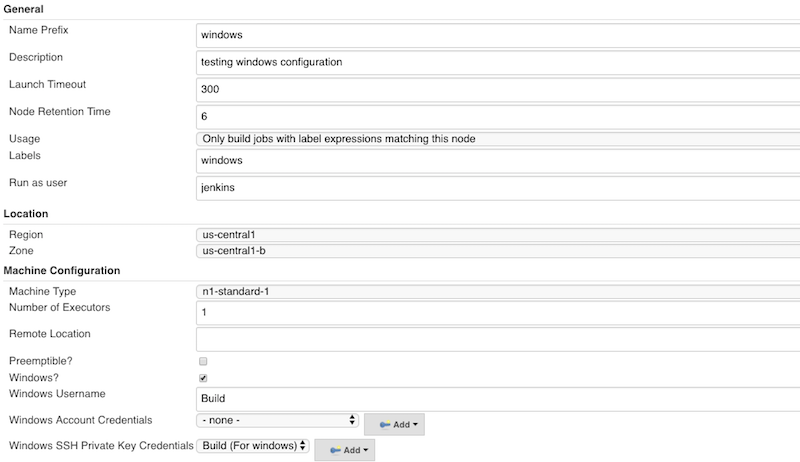
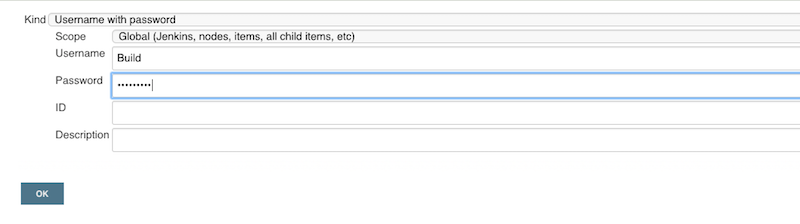
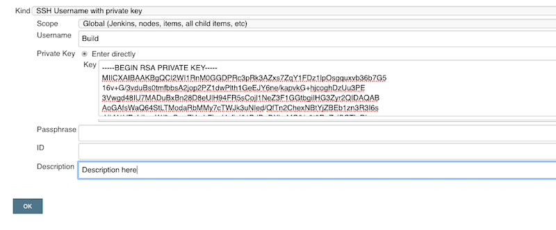

<!--
 Copyright 2020 Google LLC

 Licensed under the Apache License, Version 2.0 (the "License"); you may not use this file except in
 compliance with the License. You may obtain a copy of the License at

        https://www.apache.org/licenses/LICENSE-2.0

 Unless required by applicable law or agreed to in writing, software distributed under the License
 is distributed on an "AS IS" BASIS, WITHOUT WARRANTIES OR CONDITIONS OF ANY KIND, either express or
 implied. See the License for the specific language governing permissions and limitations under the
 License.
-->
# Running Windows VM's
* To run a VM as an agent, have both SSH and Java installed on the Windows Image. Chocolatey is recommended to install OpenSSH and Java.

## Creating a Windows Image
* Packer is used to build a Windows 2016 image from GCE with OpenSSH and Java pre-installed. Using the GCP cloud console, have the following 2 files on google cloud console.
  * For more information and an example of packer usage with the GCE jenkins plugin, see this [guide](https://cloud.google.com/solutions/using-jenkins-for-distributed-builds-on-compute-engine#create_a_jenkins_agent_image).
* Sample JSON file (jenkins-agent.json):
```
{
  "builders": [
    {
      "type": "googlecompute",
      "project_id": "my-project-id",
      "source_image_family": "windows-2016",
      "source_image_project_id": "gce-uefi-images",
      "zone": "us-central1-a",
      "disk_size": "50",
      "image_name": "jenkins-agent-windows-{{timestamp}}",
      "image_family": "jenkins-agent-windows",
      "communicator": "winrm",
      "winrm_username": "packer_user",
      "winrm_insecure": true,
      "winrm_use_ssl": true,
      "metadata": {
        "windows-startup-script-cmd": "winrm quickconfig -quiet & net user /add packer_user & net localgroup administrators packer_user /add & winrm set winrm/config/service/auth @{Basic=\"true\"}"
      }
    }
  ],
  "provisioners": [
    {
      "type": "powershell",
      "script": "windows-image-install.ps1"
    }
  ]
}
```

* sample windows-image-install.ps1
  * See this [file](windows-image-install.ps1)
  * The script installs Java and OpenSSH. Adding a user and using key-based authentication are optional but recommended. These requirements are all done in the sample script above.

* To have packer build this image, run the following in google cloud console:
```
./packer build jenkins-agent.json
```

* The terminal should output:
```
A disk image was created: jenkins-agent-windows-1494277483
```

* The jenkins-agent-1494277483 is the resulting image's name. It will now be available in the Jenkins UI under Configure System. You can now launch your Windows agent!

## Running a Windows Agent on Jenkins
* Have the following fields (Windows? and username) checked and filled out, respectively. The username must already exist in your agent.
  * See the earlier section on building an image for examples of how to configure a user


### Creating Credentials
* For security, if you wish to authenticate with the password (have it already configured for earlier said username), create a username/password credential in Jenkins.


* If authenticating with keys, install the SSH Credentials plugin. Create the credential in Jenkins; leave the passphrase portion blank.


* Your credentials should now show up under Manage Jenkins > Configure System.


* You must enter either credentials for either the password or key authentication option.